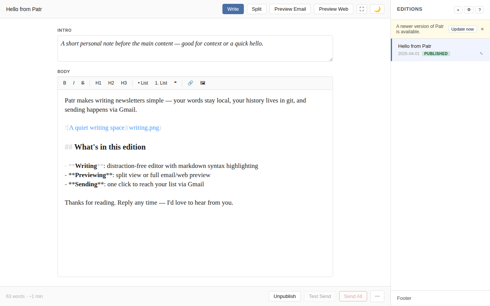
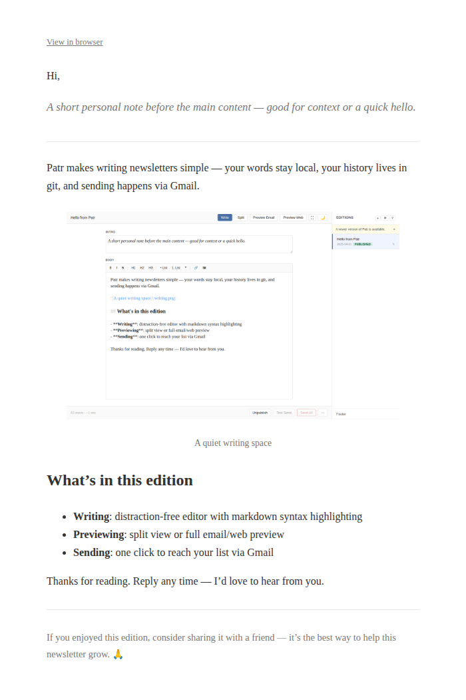

# Patr

A newsletter tool that runs on your machine.

Patr is for people who want to write a newsletter without signing up for yet
another service. Your editions live on your machine as plain markdown files —
no proprietary format, no database. Sending goes through your **Gmail**
account, with contacts managed in a **Google Sheet** you own. Optionally pair
with **Hugo** to publish a web archive, and **Git** for version history and
deployment.

The name comes from पत्र/పత్రం (Sanskrit/Telugu for "letter/document").

> **Note:** This project was largely written with [Claude
> Code](https://claude.ai/code). The code has been tested and verified, but use
> at your own discretion.

## Screenshots

**Editor** — write in markdown with syntax highlighting, auto-save, and split/preview modes.



**Email preview** — see exactly what subscribers will receive before sending.



## Prerequisites

- [uv](https://docs.astral.sh/uv/getting-started/installation/) — to install Patr (manages Python automatically)
- A GCP project with Gmail API, Google Sheets API, and OAuth 2.0 Desktop credentials (see below)
- [Git](https://git-scm.com/downloads) *(optional)* — enables auto-commit on save and publishing to a static site
- [Hugo](https://gohugo.io/installation/) *(optional)* — only needed for a web archive of your newsletter

### GCP credentials setup

1. Go to [console.cloud.google.com](https://console.cloud.google.com) and create a new project.
2. Enable the **Gmail API** and **Google Sheets API**:
   - Navigate to **APIs & Services → Library**
   - Search for and enable each API.
3. Configure the OAuth consent screen:
   - Go to **APIs & Services → OAuth consent screen**
   - Choose **External**, fill in an app name and your email, and save.
   - Under **Test users**, add the Gmail address(es) that will use Patr.
4. Create OAuth 2.0 credentials:
   - Go to **APIs & Services → Credentials → Create Credentials → OAuth client ID**
   - Choose **Desktop app**, give it a name, and click Create.
   - Download the JSON file.
5. Save the downloaded file as `~/.config/patr/credentials.json` (Linux/macOS) or `%USERPROFILE%\.config\patr\credentials.json` (Windows).

## Installation

```bash
uv tool install git+https://github.com/punchagan/patr
```

### Email-only mode (no Hugo required)

Point Patr at any directory of markdown files and start writing:

```bash
patr serve --repo /path/to/any-directory
```

No installation step needed. New editions are created as page bundles (`slug/index.md`) inside that directory. Flat `.md` files already in the directory are also recognised as editions.

### Hugo site mode

Install Patr's layouts and assets into your Hugo site:

```bash
patr install --repo /path/to/hugo-site
```

This copies Hugo templates and CSS into the site, creates `content/newsletter/` stubs, and optionally adds a nav menu entry. To customise the newsletter's appearance, edit `assets/newsletter.css` in your Hugo site after installing.

If you have existing flat `.md` newsletter editions in `content/newsletter/`, migrate them to page bundles first:

```bash
patr migrate --repo /path/to/hugo-site          # dry run
patr migrate --repo /path/to/hugo-site --apply  # apply
```

## Usage

```bash
patr serve --repo /path/to/repo-or-directory
```

Opens a browser UI at `http://127.0.0.1:5000`. Connect Gmail via the ⚙ settings panel on first use. Use `--port` to override if port 5000 is busy:

```bash
patr serve --repo /path/to/hugo-site --port 5001
```

<!-- help-start -->
## How to use Patr

### Create an edition

Click **+** in the sidebar. Give it a title and you're ready to write.

### Write

The editor supports bold, italic, headings, lists, links, and images. Writing is saved automatically. On each save a timestamped backup is written to `~/.local/share/patr/backups/`, and when Git is available a commit is also created — so you can always recover previous versions.

Click **History** in the action bar to browse previous versions, compare them to the current content, and restore an earlier one if needed.

Press **⛶** in the top-right (or hit `f`) to enter focus mode — the sidebar, action bar, title, and intro fields all hide, leaving just the editor. Press `Esc` or **⊠** to exit.

#### Intro

The **Intro** field is optional. It appears in an italicised, bordered style above the body — good for a short summary or personal note.

#### Images

Paste or drag images directly into the editor, or use the 🖼 toolbar button to upload. Images are stored alongside the edition and referenced with a relative path.

To control display size, add a title with an attribute block:

```


```

The `{…}` block supports `width`, `height`, and `style` (CSS). It is stripped from the visible caption. This works consistently in email, PDF, and the web archive.

#### Footer

Click **Footer** at the bottom of the sidebar to edit the footer that appears in every edition — unsubscribe links, social handles, a QR code, etc.

### Preview

Switch to **Split** to write and see the email preview side by side. Use **Preview Email** or **Preview Web** for a full-screen read before sending.

To share a draft for review, use **Preview Email** and click **⬇ Download PDF** — the PDF can be emailed or shared directly.

### Publish to the web

When your edition is ready, click **Mark as Live**, then **Publish**. This pushes the edition to your website.

### Configure newsletter name and mailing list

Open the **⚙ Settings** panel to set your newsletter name and connect Gmail. To enable sending, you'll also need to add your Google Sheets contacts sheet ID — paste the ID from the sheet's URL (the long string between `/d/` and `/edit`) into the **Contacts sheet ID** field.

To skip web publishing, enable **Email-only newsletter** in Settings. In this mode, images are embedded directly in the email as base64, the **Publish** button is hidden, and **Send All** is available as soon as the edition is marked as live.

### Send

Use **Test Send** to send yourself a copy first. When you're happy with it, **Send All** sends to your full mailing list. It's only available once the edition is live on the web (or email-only mode is enabled).

### Not yet supported

These things currently require editing files directly outside the app:

- **Deleting an edition** — delete the edition's folder (or `.md` file) from your content directory
- **Changing an edition's date** — edit the `date:` field in the edition's `index.md` (or `.md` file)
<!-- help-end -->

## Configuration

| Location | Contents |
|---|---|
| `{hugo-site}/hugo.toml` → `[params.patr]` | `name`, `email_only` — used in Hugo mode |
| `{dir}/patr.toml` | `name`, `email_only` — used in hugo-free mode (no `hugo.toml`) |
| `~/.config/patr/config.toml` | `sheet_id` — Google Sheets contacts sheet |
| `~/.config/patr/credentials.json` | GCP OAuth client credentials (Desktop app) |

### Contacts sheet format

Columns: `Name`, `Email`, `Send` (leave blank or set to `y` to include; `n`/`no` to opt out).

A "Sent Log" tab is created automatically on first send.

## Development

```bash
git clone https://github.com/punchagan/patr
cd patr
uv run patr serve --repo /path/to/hugo-site
```

Flask reloader is always enabled — the server restarts when Python files change.

## Content format

Editions are Hugo page bundles:

```
content/newsletter/
  my-edition/
    index.md      # frontmatter + body
    photo.jpg     # images alongside content
```

Frontmatter:

```yaml
---
title: "Edition title"
date: 2024-03-15
draft: true
intro: |
  Optional intro shown in italic/bordered style.
---

Body content. Reference images relatively: 
```
